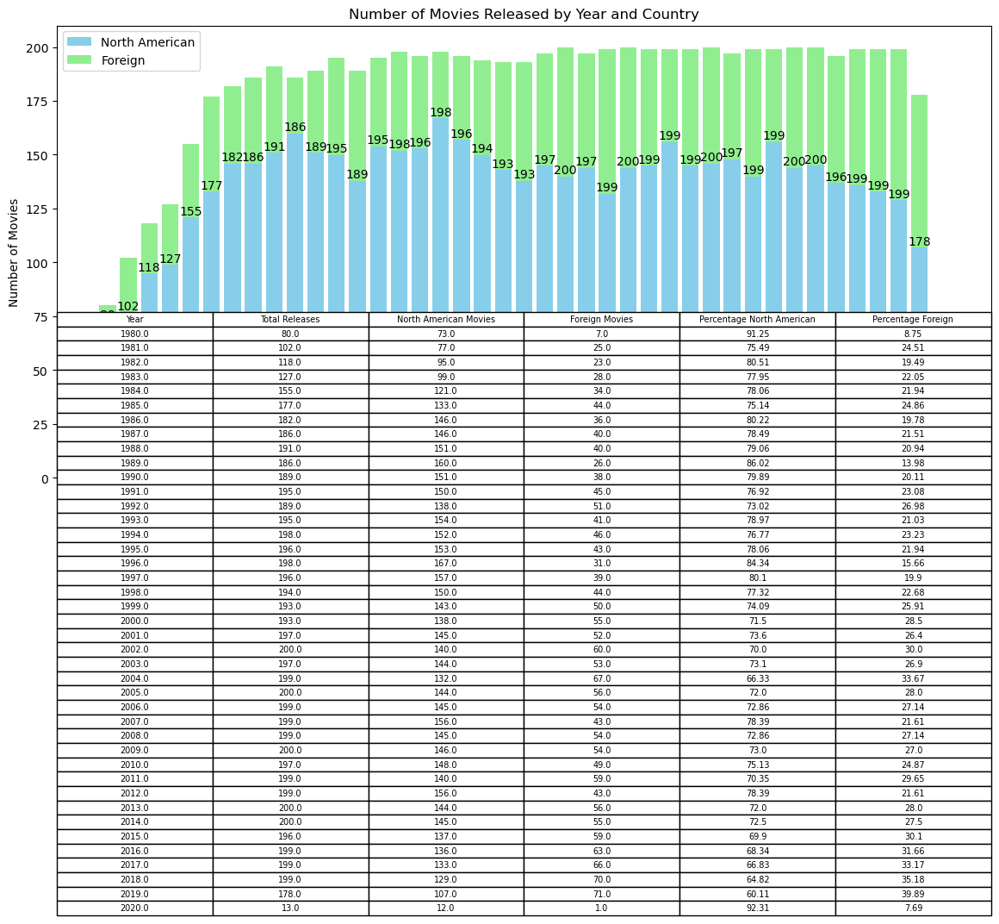
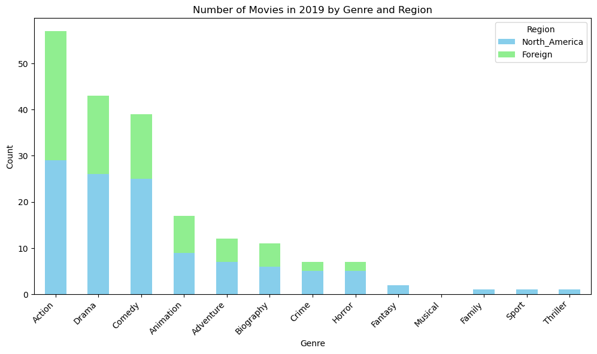
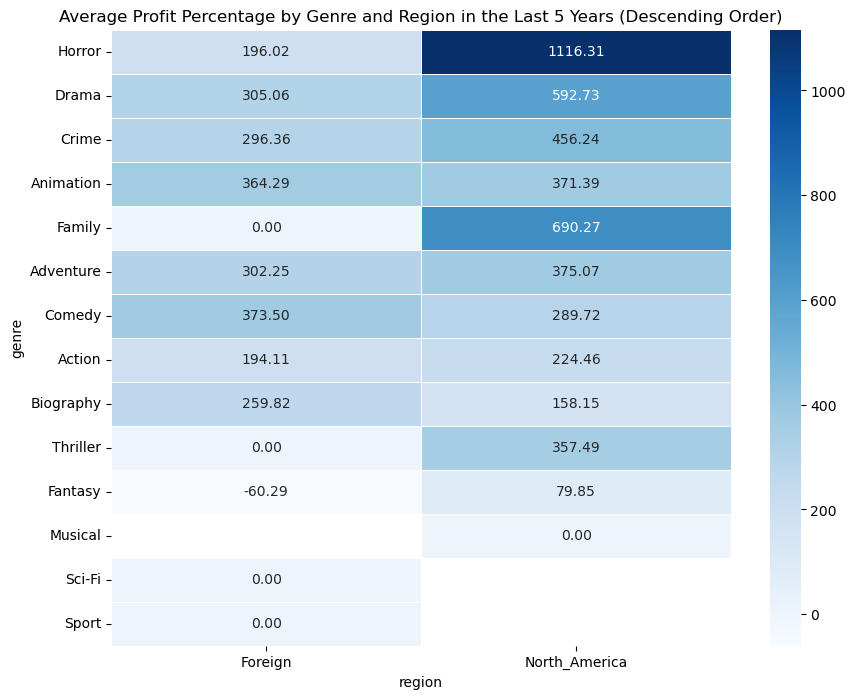
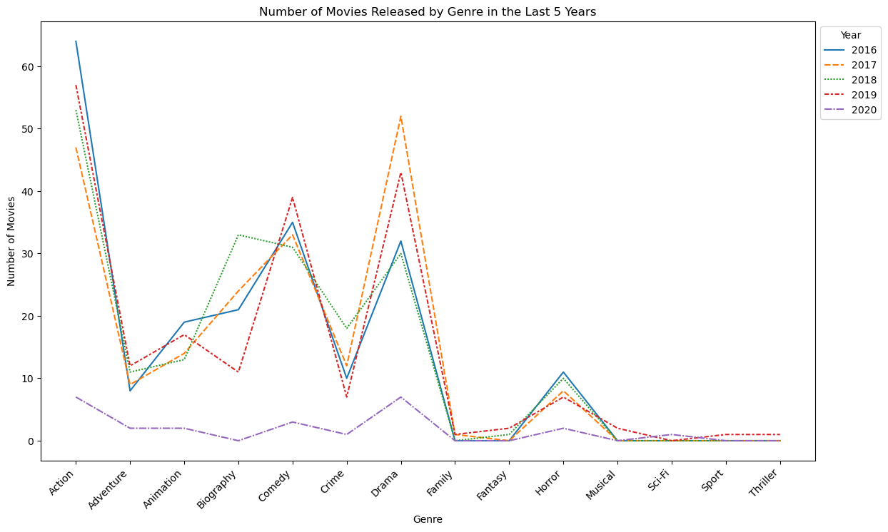
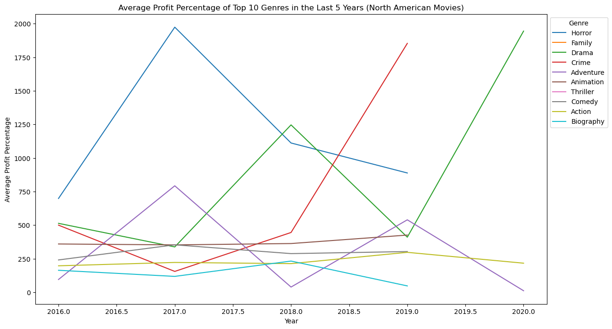

# Maximizing Movie Success: A New Producer's Guide to Choosing High-Yield Movies

*Welcome to my portfolio project!*, where I delve into the intriguing world of movies using the **'Dataset_Movies.'** This dataset provides comprehensive information on various films, offering a rich source for analysis and insights.

## Introduction

In the dynamic landscape of the film industry, navigating the terrain to **ensure a successful production can be a daunting task, especially for a small and emerging film production company**. This project stems from the collaboration with a new producer, enthusiastic about deciphering the intricacies that lead to effective resource allocation and, ultimately, the attainment of the highest possible profit.

## Business Problem

For this project", we were" contacted by **a small and new film production company who is eager to identify the features that would help them allocate their resources effectively and achieve the highest possible profit**.

To achieve this, we need to not only find the most profitable movies but also be able to provide an accurate snapshot of the movie industry usi availableng only thn questions:

## Objective

Our mission is twofold: not only to pinpoint the most profitable movies but also to paint a comprehensive picture of the movie industry using the confines of this dataset, which spans from 1980 to 2020. By doing so, we aim to provide actionable insights to address the following key questions:

1. What are the average incomes from different movie genres?
2. How is the genre distribution per year? Is there overexploitation?
3. Which movie types are increasing in demand?
4. Which elements, such as director, movie rating, runtime, score, etc., influence the profit of movies?
5. For each dollar invested in a movie, which movie type is going to give me more in return?

**Dataset Overview**

The origin of this dataset by *DANI
>EL GRIJALVA* can be found [here](https://www.kaggle.com/datasets/danielgrijalvas/movies).

The dataset encompasses a variety of details for each movie:
- **Name**: The title of the movie.
- **Rating**: The movie's rating (R, PG, etc.).
- **Genre**: The genre to which the movie belongs.
- **Year**: The year of release.
- **Released**: The specific release date.
- **Score**: The movie's IMDb user rating.
- **Votes**: The number of votes received.
- **Director**: The director of the film.
- **Writer**: The writer(s) of the movie.
- **Star**: The lead actor/actress.
- **Country**: The country of origin.
- **Budget**: The budget allocated for the movie.
- **Gross**: The total gross revenue.
- **%Gross**: The percentage of profit based on the budget.
- **Company**: The production company behind the film.
- **Runtime**: The duration of the movie.

⚠️ **Notice: This dataset only has data from 1980-2020, so we can't use this insight for recent purposes.**


## Exploratory Analysis

### 1.1 Importing file and Data Cleaning

For this, we are going to use Python and leverage the Pandas, NumPy, Matplotlib, and Seaborn libraries. We will connect to the dataset to explore and initiate the process from scratch. First, let's take a sneak peek at the data to understand its nature before delving deeper into our analysis.


```python
import pandas as pd
import numpy as np
import matplotlib.pyplot as plt
import seaborn as sns

df = pd.read_csv('Downloads/movies.csv.zip')

# Number of rows and columns in the Dataset
print(f'This Dataset contains Rows/Columns: {df.shape}')

df.head()# first 5 rows of the Dataset
```

    This Dataset contains Rows/Columns: (7668, 15)
    


<div>
<style scoped>
    .dataframe tbody tr th:only-of-type {
        vertical-align: middle;
    }

    .dataframe tbody tr th {
        vertical-align: top;
    }

    .dataframe thead th {
        text-align: right;
    }
</style>
<table border="1" class="dataframe">
  <thead>
    <tr style="text-align: right;">
      <th></th>
      <th>name</th>
      <th>rating</th>
      <th>genre</th>
      <th>year</th>
      <th>released</th>
      <th>score</th>
      <th>votes</th>
      <th>director</th>
      <th>writer</th>
      <th>star</th>
      <th>country</th>
      <th>budget</th>
      <th>gross</th>
      <th>company</th>
      <th>runtime</th>
    </tr>
  </thead>
  <tbody>
    <tr>
      <th>0</th>
      <td>The Shining</td>
      <td>R</td>
      <td>Drama</td>
      <td>1980</td>
      <td>June 13, 1980 (United States)</td>
      <td>8.4</td>
      <td>927000.0</td>
      <td>Stanley Kubrick</td>
      <td>Stephen King</td>
      <td>Jack Nicholson</td>
      <td>United Kingdom</td>
      <td>19000000.0</td>
      <td>46998772.0</td>
      <td>Warner Bros.</td>
      <td>146.0</td>
    </tr>
    <tr>
      <th>1</th>
      <td>The Blue Lagoon</td>
      <td>R</td>
      <td>Adventure</td>
      <td>1980</td>
      <td>July 2, 1980 (United States)</td>
      <td>5.8</td>
      <td>65000.0</td>
      <td>Randal Kleiser</td>
      <td>Henry De Vere Stacpoole</td>
      <td>Brooke Shields</td>
      <td>United States</td>
      <td>4500000.0</td>
      <td>58853106.0</td>
      <td>Columbia Pictures</td>
      <td>104.0</td>
    </tr>
    <tr>
      <th>2</th>
      <td>Star Wars: Episode V - The Empire Strikes Back</td>
      <td>PG</td>
      <td>Action</td>
      <td>1980</td>
      <td>June 20, 1980 (United States)</td>
      <td>8.7</td>
      <td>1200000.0</td>
      <td>Irvin Kershner</td>
      <td>Leigh Brackett</td>
      <td>Mark Hamill</td>
      <td>United States</td>
      <td>18000000.0</td>
      <td>538375067.0</td>
      <td>Lucasfilm</td>
      <td>124.0</td>
    </tr>
    <tr>
      <th>3</th>
      <td>Airplane!</td>
      <td>PG</td>
      <td>Comedy</td>
      <td>1980</td>
      <td>July 2, 1980 (United States)</td>
      <td>7.7</td>
      <td>221000.0</td>
      <td>Jim Abrahams</td>
      <td>Jim Abrahams</td>
      <td>Robert Hays</td>
      <td>United States</td>
      <td>3500000.0</td>
      <td>83453539.0</td>
      <td>Paramount Pictures</td>
      <td>88.0</td>
    </tr>
    <tr>
      <th>4</th>
      <td>Caddyshack</td>
      <td>R</td>
      <td>Comedy</td>
      <td>1980</td>
      <td>July 25, 1980 (United States)</td>
      <td>7.3</td>
      <td>108000.0</td>
      <td>Harold Ramis</td>
      <td>Brian Doyle-Murray</td>
      <td>Chevy Chase</td>
      <td>United States</td>
      <td>6000000.0</td>
      <td>39846344.0</td>
      <td>Orion Pictures</td>
      <td>98.0</td>
    </tr>
  </tbody>
</table>
</div>


This is perfect. (7668, 15) We know that we have 15 columns an 7668 rows of data and espite the limited number of variables(15), **this dataset provides valuable information that can lead to interesting insights**, ultimately helping us answer the objectives of this project.

Now, let's search for **MISSING VALUES** and identify any issues with **NaN values** in the columns. NaN values can impact statistical calculations. For instance, when calculating the mean of a column that contains NaN values, the result may be skewed, as NaN is treated as a numeric value in these calculations.


```python
# Number of rows and columns in the Dataset
print(f'This Dataset contains Rows/Columns: {df.shape}')

# Check for missing data in the DataFrame
missing_data = df.isnull()

# Count the number of missing values in each column
missing_count = missing_data.sum()

# Calculate the percentage of missing values in each column
missing_percentage = (missing_count / len(df)) * 100

# Display the columns with missing values, their respective counts, and percentages
missing_info = pd.DataFrame({
    'Missing Count': missing_count[missing_count > 0],
    'Missing Percentage': missing_percentage[missing_percentage > 0]
})

print("-Columns with missing values:")
print(missing_info)
```

    This Dataset contains Rows/Columns: (7668, 15)
    -Columns with missing values:
              Missing Count  Missing Percentage
    rating               77            1.004173
    released              2            0.026082
    score                 3            0.039124
    votes                 3            0.039124
    writer                3            0.039124
    star                  1            0.013041
    country               3            0.039124
    budget             2171           28.312467
    gross               189            2.464789
    company              17            0.221701
    runtime               4            0.052165
    

Oh! Most of the lost data is in the Budget column, which is crucial for this research. We have three options:
1. 
Delete the missing rows and lose 28% of data2. .
Impute the missing data by filling them with a specific value, such as the mean, median, or mode of the respective colum3. ***n.
Impute the missing data by filling them with the most frequent values by category (in this case, by gen***
re).
These last two options might not sound like the best choices because budgets of movies are affected by other variables. It's not the same budget for a movie if it comes from different production companies. However, these options can provide valuable insights without losing too much informatiTo be sure of this, let's perform some queries on the data and see if they change BEFORE and AFTER the imputation.e data.


```python
# Display the number of rows and columns
rows, columns = df.shape
print(f"Number of Rows: {rows}")
print(f"Number of Columns: {columns}")

# Original Dataset: Mean and Mode of 'budget' by 'genre'
original_mean_by_genre = df.groupby('genre')['budget'].mean()
original_mode_by_genre = df.groupby('genre')['budget'].apply(lambda x: x.mode().iloc[0] if not x.mode().empty else None)

# Count of missing values before imputation
missing_before_impute = df['budget'].isnull().sum()
print(f"Missing Values Before Imputation: {missing_before_impute}")

# Dataset with Imputed Values: Mean and Mode of 'budget' by 'genre'
df_copy = df.copy()
df_copy['budget'] = df_copy.groupby('genre')['budget'].transform(lambda x: x.fillna(x.mode()))
imputed_mean_by_genre = df_copy.groupby('genre')['budget'].mean()
imputed_mode_by_genre = df_copy.groupby('genre')['budget'].apply(lambda x: x.mode().iloc[0] if not x.mode().empty else None)

# Dataset with Imputed Values: Mean and Mode of 'budget' by 'genre'
df_copy = df.copy()
df_copy['budget'] = df_copy.groupby('genre')['budget'].transform(lambda x: x.fillna(x.mode()))

# Count of missing values after imputation
missing_after_impute = df_copy['budget'].isnull().sum()
print(f"Missing Values After Imputation: {missing_after_impute}")

# Create a DataFrame for comparison
comparison_df = pd.DataFrame({
    'Original Mean': original_mean_by_genre,
    'Imputed Mean': imputed_mean_by_genre,
    'Original Mode': original_mode_by_genre,
    'Imputed Mode': imputed_mode_by_genre
})

# Display the comparison table
print(comparison_df)

```

    Number of Rows: 7668
    Number of Columns: 15
    Missing Values Before Imputation: 2171
    Missing Values After Imputation: 2171
               Original Mean  Imputed Mean  Original Mode  Imputed Mode
    genre                                                              
    Action      5.808460e+07  5.808460e+07     30000000.0    30000000.0
    Adventure   4.570839e+07  4.570839e+07     25000000.0    25000000.0
    Animation   7.578520e+07  7.578520e+07     80000000.0    80000000.0
    Biography   2.531232e+07  2.531232e+07     30000000.0    30000000.0
    Comedy      2.260780e+07  2.260780e+07     20000000.0    20000000.0
    Crime       2.236357e+07  2.236357e+07     10000000.0    10000000.0
    Drama       2.291461e+07  2.291461e+07     10000000.0    10000000.0
    Family      5.112500e+07  5.112500e+07     10500000.0    10500000.0
    Fantasy     1.688571e+07  1.688571e+07     15000000.0    15000000.0
    History     3.235620e+05  3.235620e+05       323562.0      323562.0
    Horror      1.282516e+07  1.282516e+07      5000000.0     5000000.0
    Music                NaN           NaN            NaN           NaN
    Musical              NaN           NaN            NaN           NaN
    Mystery     3.187647e+07  3.187647e+07      6900000.0     6900000.0
    Romance     2.404000e+07  2.404000e+07     10000000.0    10000000.0
    Sci-Fi      1.973375e+07  1.973375e+07       370000.0      370000.0
    Sport                NaN           NaN            NaN           NaN
    Thriller    1.051111e+07  1.051111e+07      2500000.0     2500000.0
    Western     1.050000e+07  1.050000e+07     10000000.0    10000000.0
    

This is perfect! As we can see, this imputation does not affect our mean and mode before and after imputation.

So, let's impute and check again for missing values and see how many rows still have missing values.


```python
# Display the number of rows and columns
rows, columns = df.shape
print(f"Number of Rows: {rows}")
print(f"Number of Columns: {columns}")

# Impute missing 'budget' values with the mean of each genre
df_copy['budget'] = df_copy.groupby('genre')['budget'].transform(lambda x: x.fillna(x.mean()))

# Check for missing data in the DataFrame with imputed values
missing_data_imputed = df_copy.isnull()

# Count the number of missing values in each column
missing_count_imputed = missing_data_imputed.sum()

# Calculate the percentage of missing values in each column
missing_percentage_imputed = (missing_count_imputed / len(df_copy)) * 100

# Display the columns with missing values, their respective counts, and percentages
missing_info_imputed = pd.DataFrame({
    'Missing Count (Imputed)': missing_count_imputed[missing_count_imputed > 0],
    'Missing Percentage (Imputed)': missing_percentage_imputed[missing_percentage_imputed > 0]
})

print("Columns with missing values after imputation:")
print(missing_info_imputed)
```

    Number of Rows: 7668
    Number of Columns: 15
    Columns with missing values after imputation:
              Missing Count (Imputed)  Missing Percentage (Imputed)
    rating                         77                      1.004173
    released                        2                      0.026082
    score                           3                      0.039124
    votes                           3                      0.039124
    writer                          3                      0.039124
    star                            1                      0.013041
    country                         3                      0.039124
    budget                          4                      0.052165
    gross                         189                      2.464789
    company                        17                      0.221701
    runtime                         4                      0.052165
    

Ok, we could do the same for 'Rating' and 'Gross,' but **those are subjective values that depend on the audience**. It's better to have the real values for these, and we can obtain them by looking into other databases. However, this only affects 259 rows; it's better if we just delete them for now. *But keep a security copy.*


```python
# Delete rows with missing values
df_copy = df_copy.dropna()

# Number of rows and columns in the Dataset before deletion
initial_rows, initial_columns = df.shape
print(f'Initial Dataset: Rows/Columns before deletion: {initial_rows}/{initial_columns}')

# Check for missing data in the DataFrame after deletion
missing_data_after_deletion = df_copy.isnull()

# Count the number of missing values in each column
missing_count_after_deletion = missing_data_after_deletion.sum()

# Create a DataFrame with columns and their respective counts of missing values after deletion
missing_info_after_deletion = pd.DataFrame({
    'Column': missing_count_after_deletion.index,
    'Missing Count (After Deletion)': missing_count_after_deletion.values,
    'Missing Percentage (After Deletion)': (missing_count_after_deletion / len(df_copy)) * 100
})

# Display the columns with missing values after deletion, their respective counts, and percentages
print("Columns with missing values after deletion:")
print(missing_info_after_deletion)

# Number of rows and columns in the Dataset after deletion
final_rows, final_columns = df_copy.shape
print(f'Final Dataset: Rows/Columns after deletion: {final_rows}/{final_columns}')

```

    Initial Dataset: Rows/Columns before deletion: 7668/15
    Columns with missing values after deletion:
                Column  Missing Count (After Deletion)  \
    name          name                               0   
    rating      rating                               0   
    genre        genre                               0   
    year          year                               0   
    released  released                               0   
    score        score                               0   
    votes        votes                               0   
    director  director                               0   
    writer      writer                               0   
    star          star                               0   
    country    country                               0   
    budget      budget                               0   
    gross        gross                               0   
    company    company                               0   
    runtime    runtime                               0   
    
              Missing Percentage (After Deletion)  
    name                                      0.0  
    rating                                    0.0  
    genre                                     0.0  
    year                                      0.0  
    released                                  0.0  
    score                                     0.0  
    votes                                     0.0  
    director                                  0.0  
    writer                                    0.0  
    star                                      0.0  
    country                                   0.0  
    budget                                    0.0  
    gross                                     0.0  
    company                                   0.0  
    runtime                                   0.0  
    Final Dataset: Rows/Columns after deletion: 7409/15
    


```python
# Delete rows with missing values
df_copy = df_copy.dropna()

# Check for missing data in the DataFrame after deletion
missing_data_after_deletion = df_copy.isnull()

# Count the number of missing values in each column
missing_count_after_deletion = missing_data_after_deletion.sum()

# Create a DataFrame with columns and their respective counts of missing values after deletion
missing_info_after_deletion = pd.DataFrame({
    'Column': missing_count_after_deletion.index,
    'Missing Count (After Deletion)': missing_count_after_deletion.values,
    'Missing Percentage (After Deletion)': (missing_count_after_deletion / len(df_copy)) * 100
})

# Display the columns with missing values after deletion, their respective counts, and percentages
print("Columns with missing values after deletion:")
print(missing_info_after_deletion)

# Number of rows and columns in the Dataset
print(f'This Dataset contains Rows/Columns: {df_copy.shape}')
```

    Columns with missing values after deletion:
                Column  Missing Count (After Deletion)  \
    name          name                               0   
    rating      rating                               0   
    genre        genre                               0   
    year          year                               0   
    released  released                               0   
    score        score                               0   
    votes        votes                               0   
    director  director                               0   
    writer      writer                               0   
    star          star                               0   
    country    country                               0   
    budget      budget                               0   
    gross        gross                               0   
    company    company                               0   
    runtime    runtime                               0   
    
              Missing Percentage (After Deletion)  
    name                                      0.0  
    rating                                    0.0  
    genre                                     0.0  
    year                                      0.0  
    released                                  0.0  
    score                                     0.0  
    votes                                     0.0  
    director                                  0.0  
    writer                                    0.0  
    star                                      0.0  
    country                                   0.0  
    budget                                    0.0  
    gross                                     0.0  
    company                                   0.0  
    runtime                                   0.0  
    This Dataset contains Rows/Columns: (7409, 15)
    

No more MISSING DATA! and **we keep 7409 rows from the initial 7668**, Now let look for NaN values in budget and Gross columns, this is a common problem due format in dataset 


```python
# Check for NaN values in 'budget' and 'gross' columns
nan_budget = df['budget'].isnull().sum()
nan_gross = df['gross'].isnull().sum()

# Validate the format of numbers in 'budget' and 'gross' columns
try:
    df['budget'] = pd.to_numeric(df['budget'])
except ValueError:
    invalid_format_budget = True
else:
    invalid_format_budget = False

try:
    df['gross'] = pd.to_numeric(df['gross'])
except ValueError:
    invalid_format_gross = True
else:
    invalid_format_gross = False

# Display the results
print("NaN values in 'budget' column:", nan_budget)
print("NaN values in 'gross' column:", nan_gross)

if invalid_format_budget:
    print("Invalid format in 'budget' column. Please check the format.")
else:
    print("No issues with the format in 'budget' column.")

if invalid_format_gross:
    print("Invalid format in 'gross' column. Please check the format.")
else:
    print("No issues with the format in 'gross' column.")

```

    NaN values in 'budget' column: 2171
    NaN values in 'gross' column: 189
    No issues with the format in 'budget' column.
    No issues with the format in 'gross' column.
    

**We found 2630 Nan in Budget and gross columns**, now we fix this  


```python
# Impute missing 'budget' values with the mean of each genre
df_copy['budget'] = df_copy.groupby('genre')['budget'].transform(lambda x: x.fillna(x.mean()))

# Drop rows with NaN values in 'budget' and 'gross' columns
df_copy = df_copy.dropna(subset=['budget', 'gross'])

# Display the number of rows in the DataFrame after NaN elimination
rows_after_nan_elimination = len(df_copy)
print(f'Number of Rows after NaN Elimination: {rows_after_nan_elimination}')

nan_budget_after = df_copy['budget'].isnull().sum()
nan_gross_after = df_copy['gross'].isnull().sum()

print("NaN values in 'budget' column after handling:", nan_budget_after)
print("NaN values in 'gross' column after handling:", nan_gross_after)

df_copy['budget'] = pd.to_numeric(df_copy['budget'], errors='coerce')
df_copy['gross'] = pd.to_numeric(df_copy['gross'], errors='coerce')

```

    Number of Rows after NaN Elimination: 7409
    NaN values in 'budget' column after handling: 0
    NaN values in 'gross' column after handling: 0
    

Perfect! we dont have any **MISSING DATA** left, and non **NaN VALUES** inside those numerical columns. we can continue to our next part.


Finally I know that Column 'Rating' will give some problem due their mix of tex and number 


```python
# Define a mapping for numerical/symbolic ratings to text
rating_mapping = {
    'R': 'Restricted',
    'PG': 'Parental Guidance',
    'G': 'General Audiences',
    'Not Rated': 'Not Rated',
    'NC-17': 'Adults Only',
    'Approved': 'Approved',
    'PG-13': 'Parents Strongly Cautioned',
    'Unrated': 'Unrated',
    'X': 'X-rated',
    'TV-PG': 'TV-PG',
    'TV-MA': 'TV-MA',
    'TV-14': 'TV-14'
}
```

## 2. Exploratory Data Analysis (EDA)

Now that we have cleaned the data and handled missing values, it's time to dive into the exploratory analysis. This phase will help us gain insights into the dataset, answer the business questions, and make informed decisions. Let's proceed with the following steps:

### 2.1 Describe the Data: Summary Statistics

For this we are going to use Python to use the Pandas, NumPy, and Matplotlib libraries  and connect the dataset to explore and start the process from scratch.


```python
# Display summary statistics for the updated dataset
updated_numerical_summary = df_copy.describe()

# Count the number of unique values in 'genre', 'rating', 'country', and 'company'
num_unique_genre = df_copy['genre'].nunique()
num_unique_rating = df_copy['rating'].nunique()
num_unique_country = df_copy['country'].nunique()
num_unique_company = df_copy['company'].nunique()

print("Summary Statistics for Updated Dataset:")
print(updated_numerical_summary)

print("\nNumber of unique genres:", num_unique_genre)
print("Number of unique ratings:", num_unique_rating)
print("Number of unique countries:", num_unique_country)
print("Number of unique companies:", num_unique_company)
```

    Summary Statistics for Updated Dataset:
                  year        score         votes        budget         gross  \
    count  7409.000000  7409.000000  7.409000e+03  7.409000e+03  7.409000e+03   
    mean   2000.638413     6.396666  9.079857e+04  3.429810e+07  7.902508e+07   
    std      11.024481     0.963136  1.653709e+05  3.647994e+07  1.662427e+08   
    min    1980.000000     1.900000  1.050000e+02  6.000000e+03  3.090000e+02   
    25%    1991.000000     5.800000  1.000000e+04  1.300000e+07  4.636169e+06   
    50%    2001.000000     6.500000  3.400000e+04  2.291461e+07  2.042113e+07   
    75%    2010.000000     7.100000  9.600000e+04  4.000000e+07  7.647105e+07   
    max    2020.000000     9.300000  2.400000e+06  3.560000e+08  2.847246e+09   
    
               runtime  
    count  7409.000000  
    mean    107.440545  
    std      18.511985  
    min      63.000000  
    25%      95.000000  
    50%     104.000000  
    75%     116.000000  
    max     366.000000  
    
    Number of unique genres: 15
    Number of unique ratings: 12
    Number of unique countries: 57
    Number of unique companies: 2239
    

#### Observations:
In general we can tell for this dataset that :


1. ***Dataset Overview:***
   - The dataset comprises 7,409 movies released between 1980 and 2020.
   - Movies are categorized into 15 genres, rated on 12 differecategoriesles, originating from 57 countries, and produced by 2,239 different companies.

2. ***Ratings and Scores:***
   - Movies in the dataset have ratings ranging from 1.9 to 9.3, with an average score of 6.3 out of 10.
   - The diversity in ratings suggests a wide range of audience preferences and critical acclai.

3. ****Global Distribution:***
   - The dataset reflects a global perspective with movies originating from 57 different countries. This diversity indicates a broad representation of cultures and storytelling.

4. ***Competition and Production:***
   - The movie market is competitive, with 2,239 companies contributing to the dataset. This suggests a dynamic industry with numerous players and potential collaborators.
   - Producers face a challenge in navigating a complex landscape with a large number of competitors.

5. ***Budget and Gross Revenue:***
   - The average budget for movies globally is 34 million dollars, with a minimum of 6 thousand dollars and a maximum of 354 million dollars. This wide range indicates varying investment levels in movie production.
   - The average gross revenue for movies globally is 79 million dollars, with a minimum of 300 dollars and a maximum of 2 billion dollars. This suggests significant variability in box office performance.

6. ***Market Uncertainty:***
   - The diversity in genres, ratings, countries of origin, and production companies, coupled with the wide range of budget and revenue figures, highlights the complexity and unpredictability of the movie market.
   - Movie producers may find it challenging to predict success factors given the multitude of variables.

7. ***Potential Business Challenges:***
   - The wide variability in ratings, budget, and revenue underscores the uncertainty in predicting movie success.
   - Movie producers may need to carefully strategize and analyze market trends to make informed decisions and mitigate risks.
audience preferences, market trends, and effective budgeting will be crucial for success in this competitive and unpredictable industry.c, and challenging for prodand unpredictable industry.and unpredictable industry.and unpredictable industry.

## 2.2 Data Visualization and Analysis.

### 2.2.1 Number of Movies Released by Year and Region

For this excercise we are going to focus on movies from North America (United States and Canada) and Foreign movies.


```python
# If it has 'year' and 'country' columns, you can use them to count the number of movies released by year and country
movies_by_year_country = df_copy.groupby(['year', 'country']).size().unstack(fill_value=0)

# Separate North American and Foreign movies
north_american_movies = movies_by_year_country[['United States', 'Canada']].sum(axis=1)
foreign_movies = movies_by_year_country.drop(['United States', 'Canada'], axis=1).sum(axis=1)

# Plotting
fig, (ax1, ax2) = plt.subplots(2, 1, figsize=(14, 10), gridspec_kw={'height_ratios': [3, 1]})

# Bar plot for North American and Foreign movies
bars_north_american = ax1.bar(north_american_movies.index, north_american_movies.values, color='skyblue', label='North American')
bars_foreign = ax1.bar(foreign_movies.index, foreign_movies.values, bottom=north_american_movies.values, color='lightgreen', label='Foreign')

# Add total releases on top of each bar
for bar, total in zip(bars_north_american + bars_foreign, (north_american_movies + foreign_movies).values):
    ax1.text(bar.get_x() + bar.get_width() / 2, bar.get_height(), str(total),
             ha='center', va='bottom')

# Table with values and percentages
table_data = pd.DataFrame({
    'Year': (north_american_movies + foreign_movies).index,
    'Total Releases': (north_american_movies + foreign_movies).values,
    'North American Movies': north_american_movies.values,
    'Foreign Movies': foreign_movies.values,
    'Percentage North American': (north_american_movies / (north_american_movies + foreign_movies) * 100).round(2),
    'Percentage Foreign': (foreign_movies / (north_american_movies + foreign_movies) * 100).round(2)
})

# Display the table
ax2.axis('off')
ax2.table(cellText=table_data.values, colLabels=table_data.columns, cellLoc = 'center', loc='center')

# Set titles and labels
ax1.set_title('Number of Movies Released by Year and Country')
ax1.set_xlabel('Year')
ax1.set_ylabel('Number of Movies')
ax1.legend()

plt.show()
```


    

    


#### Observations:
As evident from the graph, **this dataset indicates a consistent average of movies from both foreign countries and North America in recent years**, with the exception of the year 2020. 

### 2.2.2 Film Industry Overview: Total Gross, Annual Increment (%), and Percentages in the Last 10 Years.


```python
# Convert 'year' column to numeric
df_copy['year'] = pd.to_numeric(df_copy['year'], errors='coerce')

# Filter data for the last 10 years
last_10_years = df_copy[df_copy['year'] >= 2011]

# Calculate Total Gross, Annual Increment (%), % North American, and % Foreign
total_gross = last_10_years.groupby('year')['gross'].sum()
annual_increment = total_gross.diff()
annual_increment_percentage = (annual_increment / total_gross.shift(1)) * 100
percentage_north_american = (last_10_years[last_10_years['country'].isin(['United States', 'Canada'])].groupby('year')['gross'].sum() / total_gross) * 100
percentage_foreign = 100 - percentage_north_american

# Create a DataFrame for the table
table_data = pd.DataFrame({
    'Year': total_gross.index,
    'Total Gross': total_gross.map('${:,.0f}'.format),  # Format as dollars
    'Annual growth (%)': annual_increment_percentage,
    '% North American': percentage_north_american.round(2),
    '% Foreign': percentage_foreign.round(2)
})

# Display the table without cell colors
table_data

```


<div>
<style scoped>
    .dataframe tbody tr th:only-of-type {
        vertical-align: middle;
    }

    .dataframe tbody tr th {
        vertical-align: top;
    }

    .dataframe thead th {
        text-align: right;
    }
</style>
<table border="1" class="dataframe">
  <thead>
    <tr style="text-align: right;">
      <th></th>
      <th>Year</th>
      <th>Total Gross</th>
      <th>Annual growth (%)</th>
      <th>% North American</th>
      <th>% Foreign</th>
    </tr>
    <tr>
      <th>year</th>
      <th></th>
      <th></th>
      <th></th>
      <th></th>
      <th></th>
    </tr>
  </thead>
  <tbody>
    <tr>
      <th>2011</th>
      <td>2011</td>
      <td>$24,837,686,836</td>
      <td>NaN</td>
      <td>83.25</td>
      <td>16.75</td>
    </tr>
    <tr>
      <th>2012</th>
      <td>2012</td>
      <td>$25,438,106,033</td>
      <td>2.417372</td>
      <td>78.81</td>
      <td>21.19</td>
    </tr>
    <tr>
      <th>2013</th>
      <td>2013</td>
      <td>$25,995,848,674</td>
      <td>2.192548</td>
      <td>86.52</td>
      <td>13.48</td>
    </tr>
    <tr>
      <th>2014</th>
      <td>2014</td>
      <td>$26,491,482,563</td>
      <td>1.906589</td>
      <td>82.39</td>
      <td>17.61</td>
    </tr>
    <tr>
      <th>2015</th>
      <td>2015</td>
      <td>$26,706,384,309</td>
      <td>0.811211</td>
      <td>84.83</td>
      <td>15.17</td>
    </tr>
    <tr>
      <th>2016</th>
      <td>2016</td>
      <td>$28,937,994,373</td>
      <td>8.356092</td>
      <td>81.52</td>
      <td>18.48</td>
    </tr>
    <tr>
      <th>2017</th>
      <td>2017</td>
      <td>$28,484,051,746</td>
      <td>-1.568673</td>
      <td>80.02</td>
      <td>19.98</td>
    </tr>
    <tr>
      <th>2018</th>
      <td>2018</td>
      <td>$28,084,326,806</td>
      <td>-1.403329</td>
      <td>78.03</td>
      <td>21.97</td>
    </tr>
    <tr>
      <th>2019</th>
      <td>2019</td>
      <td>$29,444,836,244</td>
      <td>4.844373</td>
      <td>78.54</td>
      <td>21.46</td>
    </tr>
    <tr>
      <th>2020</th>
      <td>2020</td>
      <td>$2,581,816,761</td>
      <td>-91.231682</td>
      <td>82.13</td>
      <td>17.87</td>
    </tr>
  </tbody>
</table>
</div>


#### Observations:
Ok, this is a billion-dollar market each year, with most of the profit coming from movies in the United States and Canada, **showing an annual increment most of the time. The years that experience a decrease typically hover around 2%.**

The latest increase occurred in 2019, with a growth of 5%. **Let's examine that specific year in detail to understand how the movie market developed.**

### 2.2.3.1 Number of Movies in 2019 by Region and Genre 


```python
# Filter movies from 2019
df_2019 = df[df['year'] == 2019].copy()  # Make a copy to avoid the SettingWithCopyWarning

# Create a new column 'region' based on 'country'
df_2019['region'] = df_2019['country'].apply(lambda x: 'North_America' if x in ['United States', 'Canada'] else 'Foreign')

# Count the number of movies in each genre and region
genre_region_counts = df_2019.groupby(['genre', 'region']).size().unstack()

# Calculate the total counts of movies by genres
total_counts_by_genre = genre_region_counts.sum(axis=1)

# Sort the DataFrame based on total counts
genre_region_counts_sorted = genre_region_counts.loc[total_counts_by_genre.sort_values(ascending=False).index]

# Plotting the bar graph with the specified colors and sorted order
fig, ax = plt.subplots(figsize=(12, 6))

# Specify colors for North American and Foreign movies
colors = ['skyblue', 'lightgreen']

# Bar plot for North American and Foreign movies with sorted order
genre_region_counts_sorted['North_America'].plot(kind='bar', stacked=True, color=colors[0], ax=ax)
genre_region_counts_sorted['Foreign'].plot(kind='bar', stacked=True, color=colors[1], ax=ax, bottom=genre_region_counts_sorted['North_America'])

# Set titles and labels
ax.set_title('Number of Movies in 2019 by Genre and Region')
ax.set_xlabel('Genre')
ax.set_ylabel('Count')
ax.legend(title='Region', loc='upper right')

# Rotate x-axis labels
plt.xticks(rotation=45, ha='right')

plt.show()
```


    

    


### 2.2.3.2 Number of Movies in 2019 by Region and Genre (Descending Sum of Counts Order)


```python
# Count the number of movies in each genre and region
genre_region_counts = df_2019.groupby(['genre', 'region']).size().unstack()

# Transpose the DataFrame to have regions as rows and genres as columns
genre_region_counts_transposed = genre_region_counts.T

# Replace NaN values with 0
genre_region_counts_transposed = genre_region_counts_transposed.fillna(0)

# Sort the DataFrame based on the sum of counts for each region in descending order
genre_region_counts_transposed_sorted = genre_region_counts_transposed.loc[:, genre_region_counts_transposed.sum(axis=0).sort_values(ascending=False).index]

# Reorder rows with 'North_America' on top
genre_region_counts_transposed_sorted = genre_region_counts_transposed_sorted.reindex(['North_America', 'Foreign'])

# Styling the DataFrame
styled_table = genre_region_counts_transposed_sorted.style.background_gradient(cmap='Blues', axis=1, subset=pd.IndexSlice[:, :])

# Hide the index
styled_table.set_table_styles([{'selector': 'index', 'props': 'display: none;'}]).set_caption("Number of Movies in 2019 by Region and Genre (Descending Sum of Counts Order)")
```


<style type="text/css">
#T_7979c index {
  display: none;
}
#T_7979c_row0_col0, #T_7979c_row1_col0 {
  background-color: #08306b;
  color: #f1f1f1;
}
#T_7979c_row0_col1 {
  background-color: #084b93;
  color: #f1f1f1;
}
#T_7979c_row0_col2 {
  background-color: #0a549e;
  color: #f1f1f1;
}
#T_7979c_row0_col3 {
  background-color: #b3d3e8;
  color: #000000;
}
#T_7979c_row0_col4 {
  background-color: #c8dcf0;
  color: #000000;
}
#T_7979c_row0_col5 {
  background-color: #cfe1f2;
  color: #000000;
}
#T_7979c_row0_col6, #T_7979c_row0_col7 {
  background-color: #d5e5f4;
  color: #000000;
}
#T_7979c_row0_col8 {
  background-color: #eaf2fb;
  color: #000000;
}
#T_7979c_row0_col9, #T_7979c_row1_col8, #T_7979c_row1_col10, #T_7979c_row1_col11, #T_7979c_row1_col12 {
  background-color: #f7fbff;
  color: #000000;
}
#T_7979c_row0_col10, #T_7979c_row0_col11, #T_7979c_row0_col12 {
  background-color: #f1f7fd;
  color: #000000;
}
#T_7979c_row1_col1 {
  background-color: #4896c8;
  color: #f1f1f1;
}
#T_7979c_row1_col2 {
  background-color: #6aaed6;
  color: #f1f1f1;
}
#T_7979c_row1_col3 {
  background-color: #bad6eb;
  color: #000000;
}
#T_7979c_row1_col4, #T_7979c_row1_col5 {
  background-color: #d4e4f4;
  color: #000000;
}
#T_7979c_row1_col6, #T_7979c_row1_col7, #T_7979c_row1_col9 {
  background-color: #e9f2fa;
  color: #000000;
}
</style>
<table id="T_7979c">
  <caption>Number of Movies in 2019 by Region and Genre (Descending Sum of Counts Order)</caption>
  <thead>
    <tr>
      <th class="index_name level0" >genre</th>
      <th id="T_7979c_level0_col0" class="col_heading level0 col0" >Action</th>
      <th id="T_7979c_level0_col1" class="col_heading level0 col1" >Drama</th>
      <th id="T_7979c_level0_col2" class="col_heading level0 col2" >Comedy</th>
      <th id="T_7979c_level0_col3" class="col_heading level0 col3" >Animation</th>
      <th id="T_7979c_level0_col4" class="col_heading level0 col4" >Adventure</th>
      <th id="T_7979c_level0_col5" class="col_heading level0 col5" >Biography</th>
      <th id="T_7979c_level0_col6" class="col_heading level0 col6" >Crime</th>
      <th id="T_7979c_level0_col7" class="col_heading level0 col7" >Horror</th>
      <th id="T_7979c_level0_col8" class="col_heading level0 col8" >Fantasy</th>
      <th id="T_7979c_level0_col9" class="col_heading level0 col9" >Musical</th>
      <th id="T_7979c_level0_col10" class="col_heading level0 col10" >Family</th>
      <th id="T_7979c_level0_col11" class="col_heading level0 col11" >Sport</th>
      <th id="T_7979c_level0_col12" class="col_heading level0 col12" >Thriller</th>
    </tr>
    <tr>
      <th class="index_name level0" >region</th>
      <th class="blank col0" >&nbsp;</th>
      <th class="blank col1" >&nbsp;</th>
      <th class="blank col2" >&nbsp;</th>
      <th class="blank col3" >&nbsp;</th>
      <th class="blank col4" >&nbsp;</th>
      <th class="blank col5" >&nbsp;</th>
      <th class="blank col6" >&nbsp;</th>
      <th class="blank col7" >&nbsp;</th>
      <th class="blank col8" >&nbsp;</th>
      <th class="blank col9" >&nbsp;</th>
      <th class="blank col10" >&nbsp;</th>
      <th class="blank col11" >&nbsp;</th>
      <th class="blank col12" >&nbsp;</th>
    </tr>
  </thead>
  <tbody>
    <tr>
      <th id="T_7979c_level0_row0" class="row_heading level0 row0" >North_America</th>
      <td id="T_7979c_row0_col0" class="data row0 col0" >29.000000</td>
      <td id="T_7979c_row0_col1" class="data row0 col1" >26.000000</td>
      <td id="T_7979c_row0_col2" class="data row0 col2" >25.000000</td>
      <td id="T_7979c_row0_col3" class="data row0 col3" >9.000000</td>
      <td id="T_7979c_row0_col4" class="data row0 col4" >7.000000</td>
      <td id="T_7979c_row0_col5" class="data row0 col5" >6.000000</td>
      <td id="T_7979c_row0_col6" class="data row0 col6" >5.000000</td>
      <td id="T_7979c_row0_col7" class="data row0 col7" >5.000000</td>
      <td id="T_7979c_row0_col8" class="data row0 col8" >2.000000</td>
      <td id="T_7979c_row0_col9" class="data row0 col9" >0.000000</td>
      <td id="T_7979c_row0_col10" class="data row0 col10" >1.000000</td>
      <td id="T_7979c_row0_col11" class="data row0 col11" >1.000000</td>
      <td id="T_7979c_row0_col12" class="data row0 col12" >1.000000</td>
    </tr>
    <tr>
      <th id="T_7979c_level0_row1" class="row_heading level0 row1" >Foreign</th>
      <td id="T_7979c_row1_col0" class="data row1 col0" >28.000000</td>
      <td id="T_7979c_row1_col1" class="data row1 col1" >17.000000</td>
      <td id="T_7979c_row1_col2" class="data row1 col2" >14.000000</td>
      <td id="T_7979c_row1_col3" class="data row1 col3" >8.000000</td>
      <td id="T_7979c_row1_col4" class="data row1 col4" >5.000000</td>
      <td id="T_7979c_row1_col5" class="data row1 col5" >5.000000</td>
      <td id="T_7979c_row1_col6" class="data row1 col6" >2.000000</td>
      <td id="T_7979c_row1_col7" class="data row1 col7" >2.000000</td>
      <td id="T_7979c_row1_col8" class="data row1 col8" >0.000000</td>
      <td id="T_7979c_row1_col9" class="data row1 col9" >2.000000</td>
      <td id="T_7979c_row1_col10" class="data row1 col10" >0.000000</td>
      <td id="T_7979c_row1_col11" class="data row1 col11" >0.000000</td>
      <td id="T_7979c_row1_col12" class="data row1 col12" >0.000000</td>
    </tr>
  </tbody>
</table>


#### Observations:

1. **Action,Drama, and  Comedy Dominate:****
   - Action, Comedy, and Drama genres have the highest movie counts in both North American and Foreign regions, indicating their widespread popularity3

2. **Animation and Adventure Have a Significant Presence:**
   - Genres like Animation and Adventure also have a notable presence, reflecting demand for animated and adventurous cont4nt.

3. **Biography, Horror, Crime, Fantasy, and Thriller:**
   - These genres, while having lower counts compared to the top genres, contribute to the overall diversity of the movie lan5scape.

4. **Limited Foreign Presence in Horror, Fantasy, and Thriller:**
   - In the Foreign category, Horror, Fantasy, and Thriller genres have fewer movies or are possibly less popular compared to oth6r genres.

5. **Overall Diversity:**
   - The variety of genres, each with some representation, suggests a diverse movie landscape catering to different audience7preferences.

6. **North American Dominance in Most Genres:**
   - North American movies generally have higher counts across most genres, indicating a robust film industry in the USA and Canada.

These insights are based on the data for the year 2019, and trends may vary in different years. Viewer preferences and industry dynamics can influence the production and popularity of certain genres.

## 2.2.4 Average Budget By Genre in Regions (Past 5 years)

Lets look for the Minumun, Average, Maximun Budget of movies in North America and foreign markets fot the past 5 years. 


```python
import pandas as pd

# Function to calculate the average budget in millions
def average_budget_in_millions(series):
    return series.mean() / 1000000

# Filter movies from the last 5 years
df_last_5_years = df[df['year'] >= 2016].copy()

# Create a new column 'region' based on 'country'
df_last_5_years['region'] = df_last_5_years['country'].apply(lambda x: 'North_America' if x in ['United States', 'Canada'] else 'Foreign')

# Group by 'genre' and 'region' and calculate the required statistics
genre_region_budget_stats = df_last_5_years.groupby(['genre', 'region'])['budget'].agg(['min', 'max', average_budget_in_millions]).reset_index()

# Convert 'average_budget_in_millions' to numeric and handle NaN values
genre_region_budget_stats['average_budget_in_millions'] = pd.to_numeric(genre_region_budget_stats['average_budget_in_millions'], errors='coerce')

# Format 'min', 'max', and 'mean' budget values with currency format
genre_region_budget_stats['min'] = genre_region_budget_stats['min'].apply(lambda x: "${:,.0f}".format(x))
genre_region_budget_stats['max'] = genre_region_budget_stats['max'].apply(lambda x: "${:,.0f}".format(x))
genre_region_budget_stats['average_budget_in_millions'] = genre_region_budget_stats['average_budget_in_millions'].apply(lambda x: "${:,.0f}".format(x * 1000000) if not pd.isna(x) else 'N/A')

# Rename columns for clarity
genre_region_budget_stats.columns = ['Genre', 'Region', 'Min Budget (M)', 'Max Budget (M)', 'Avg Budget per Movie (M)']

# Sort the DataFrame by 'Avg Budget per Movie (M)' and 'Genre'
genre_region_budget_stats_sorted = genre_region_budget_stats.sort_values(by=['Genre', 'Avg Budget per Movie (M)'], ascending=[True, False])

# Display the sorted and formatted budget statistics table
genre_region_budget_stats_sorted

```


<div>
<style scoped>
    .dataframe tbody tr th:only-of-type {
        vertical-align: middle;
    }

    .dataframe tbody tr th {
        vertical-align: top;
    }

    .dataframe thead th {
        text-align: right;
    }
</style>
<table border="1" class="dataframe">
  <thead>
    <tr style="text-align: right;">
      <th></th>
      <th>Genre</th>
      <th>Region</th>
      <th>Min Budget (M)</th>
      <th>Max Budget (M)</th>
      <th>Avg Budget per Movie (M)</th>
    </tr>
  </thead>
  <tbody>
    <tr>
      <th>1</th>
      <td>Action</td>
      <td>North_America</td>
      <td>$10,000</td>
      <td>$356,000,000</td>
      <td>$94,252,095</td>
    </tr>
    <tr>
      <th>0</th>
      <td>Action</td>
      <td>Foreign</td>
      <td>$10,000,000</td>
      <td>$250,000,000</td>
      <td>$80,227,778</td>
    </tr>
    <tr>
      <th>3</th>
      <td>Adventure</td>
      <td>North_America</td>
      <td>$6,200,000</td>
      <td>$185,000,000</td>
      <td>$91,600,000</td>
    </tr>
    <tr>
      <th>2</th>
      <td>Adventure</td>
      <td>Foreign</td>
      <td>$2,000,000</td>
      <td>$200,000,000</td>
      <td>$79,946,154</td>
    </tr>
    <tr>
      <th>4</th>
      <td>Animation</td>
      <td>Foreign</td>
      <td>$8,500,000</td>
      <td>$99,000,000</td>
      <td>$51,276,923</td>
    </tr>
    <tr>
      <th>5</th>
      <td>Animation</td>
      <td>North_America</td>
      <td>$3,500,000</td>
      <td>$260,000,000</td>
      <td>$100,575,000</td>
    </tr>
    <tr>
      <th>7</th>
      <td>Biography</td>
      <td>North_America</td>
      <td>$6,000,000</td>
      <td>$159,000,000</td>
      <td>$27,487,179</td>
    </tr>
    <tr>
      <th>6</th>
      <td>Biography</td>
      <td>Foreign</td>
      <td>$3,500,000</td>
      <td>$52,000,000</td>
      <td>$22,636,000</td>
    </tr>
    <tr>
      <th>9</th>
      <td>Comedy</td>
      <td>North_America</td>
      <td>$900,000</td>
      <td>$130,000,000</td>
      <td>$23,066,667</td>
    </tr>
    <tr>
      <th>8</th>
      <td>Comedy</td>
      <td>Foreign</td>
      <td>$3,000,000</td>
      <td>$75,000,000</td>
      <td>$19,250,000</td>
    </tr>
    <tr>
      <th>10</th>
      <td>Crime</td>
      <td>Foreign</td>
      <td>$4,500,000</td>
      <td>$55,000,000</td>
      <td>$27,642,857</td>
    </tr>
    <tr>
      <th>11</th>
      <td>Crime</td>
      <td>North_America</td>
      <td>$4,500,000</td>
      <td>$55,000,000</td>
      <td>$23,994,118</td>
    </tr>
    <tr>
      <th>13</th>
      <td>Drama</td>
      <td>North_America</td>
      <td>$5,000</td>
      <td>$110,000,000</td>
      <td>$21,650,232</td>
    </tr>
    <tr>
      <th>12</th>
      <td>Drama</td>
      <td>Foreign</td>
      <td>$4,000,000</td>
      <td>$30,000,000</td>
      <td>$15,385,714</td>
    </tr>
    <tr>
      <th>14</th>
      <td>Family</td>
      <td>North_America</td>
      <td>$160,000,000</td>
      <td>$160,000,000</td>
      <td>$160,000,000</td>
    </tr>
    <tr>
      <th>16</th>
      <td>Fantasy</td>
      <td>North_America</td>
      <td>$5,000,000</td>
      <td>$6,000,000</td>
      <td>$5,500,000</td>
    </tr>
    <tr>
      <th>15</th>
      <td>Fantasy</td>
      <td>Foreign</td>
      <td>$20,000,000</td>
      <td>$20,000,000</td>
      <td>$20,000,000</td>
    </tr>
    <tr>
      <th>18</th>
      <td>Horror</td>
      <td>North_America</td>
      <td>$1,000,000</td>
      <td>$97,000,000</td>
      <td>$15,688,000</td>
    </tr>
    <tr>
      <th>17</th>
      <td>Horror</td>
      <td>Foreign</td>
      <td>$1,500,000</td>
      <td>$58,000,000</td>
      <td>$14,600,000</td>
    </tr>
    <tr>
      <th>19</th>
      <td>Musical</td>
      <td>Foreign</td>
      <td>$nan</td>
      <td>$nan</td>
      <td>N/A</td>
    </tr>
    <tr>
      <th>20</th>
      <td>Sci-Fi</td>
      <td>North_America</td>
      <td>$370,000</td>
      <td>$370,000</td>
      <td>$370,000</td>
    </tr>
    <tr>
      <th>21</th>
      <td>Sport</td>
      <td>North_America</td>
      <td>$nan</td>
      <td>$nan</td>
      <td>N/A</td>
    </tr>
    <tr>
      <th>22</th>
      <td>Thriller</td>
      <td>North_America</td>
      <td>$8,000,000</td>
      <td>$8,000,000</td>
      <td>$8,000,000</td>
    </tr>
  </tbody>
</table>
</div>


#### Observations:
Based on the tabulated results for the minimum, maximum, and average budget per movie for different genres in North American and Foreign regions over the past 5 years:

#### **Action Genre:**

- **North America:**
  - Average budget: $94.25 million
  - Range: $10,000 to $356 million

- **Foreign:**
  - Average budget: $80.23 million
  - Range: $10 million to $250 million

#### **Adventure Genre:**

- **North America:**
  - Average budget: $91.6 million
  - Range: $6.2 million to $185 million

- **Foreign:**
  - Average budget: $79.95 million
  - Range: $2 million to $200 million

#### **Animation Genre:**

- **North America:**
  - Average budget: $100.58 million
  - Range: $3.5 million to $260 million

- **Foreign:**
  - Average budget: $51.28 million
  - Range: $8.5 million to $99 million

#### **Biography Genre:**

- **North America:**
  - Average budget: $27.49 million
  - Range: $6 million to $159 million

- **Foreign:**
  - Average budget: $22.64 million
  - Range: $3.5 million to $52 million

#### **Comedy Genre:**

- **North America:**
  - Average budget: $23.07 million
  - Range: $900,000 to $130 million

- **Foreign:**
  - Average budget: $19.25 million
  - Range: $3 million to $75 million

#### **Crime Genre:**

- **North America:**
  - Average budget: $23.99 million
  - Range: $4.5 million to $55 million

- **Foreign:**
  - Average budget: $27.64 million
  - Range: $4.5 million to $55 million

#### **Drama Genre:**

- **North America:**
  - Average budget: $21.65 million
  - Range: $5,000 to $110 million

- **Foreign:**
  - Average budget: $15.39 million
  - Range: $4 million to $30 million

#### **Family Genre:**

- **North America:**
  - Consistent budget: $160 million

#### **Fantasy Genre:**

- **North America:**
  - Average budget: $5.5 million
  - Range: $5 million to $6 million

- **Foreign:**
  - Consistent budget: $20 million

#### **Horror Genre:**

- **North America:**
  - Average budget: $15.69 million
  - Range: $1 million to $97 million

- **Foreign:**
  - Average budget: $14.6 million
  - Range: $1.5 million to $58 million

#### **Musical and Sport Genres:**

- **Insufficient data available for both Musical and Sport genres in the Foreign region.**

#### **Sci-Fi Genre:**

- **North America:**
  - Consistent budget: $370,000

#### **Thriller Genre:**

- **North America:**
  - Consistent budget: $8 million

These insights provide an overview of the budget distribution within each genre for both North American and Foreign regions. It highlights the variability and trends in budget allocation for different genres.


### 2.2.5 Average Profit Percentage by Genre and Region in the Last 5 Years

Let's examine a ranked table that combines budget and gross figures to determine which genre yields the highest return margin. This information is crucial to understand, as profitability is not solely determined by revenue; considering both budget and gross helps identify genres with the most favorable return on investment.


```python
# Filter movies from the last 5 years
df_last_5_years = df[df['year'] >= 2016].copy()  # Make a copy to avoid the SettingWithCopyWarning

# Calculate the percentage of profit based on the budget and gross
df_last_5_years['profit_percentage'] = ((df_last_5_years['gross'] - df_last_5_years['budget']) / df_last_5_years['budget']) * 100

# Create a new column 'region' based on 'country'
df_last_5_years['region'] = df_last_5_years['country'].apply(lambda x: 'North_America' if x in ['United States', 'Canada'] else 'Foreign')

# Group by 'genre' and 'region' and calculate the average profit percentage
genre_region_profit_percentage_last_5_years = df_last_5_years.groupby(['genre', 'region'])['profit_percentage'].mean().unstack(fill_value=0)

# Arrange genres in descending order based on average profit percentage
genre_order_last_5_years = genre_region_profit_percentage_last_5_years.mean(axis=1).sort_values(ascending=False).index
genre_region_profit_percentage_last_5_years = genre_region_profit_percentage_last_5_years.loc[genre_order_last_5_years]

# Create a heatmap using seaborn
plt.figure(figsize=(10, 8))
sns.heatmap(genre_region_profit_percentage_last_5_years, cmap='Blues', annot=True, fmt=".2f", linewidths=.5)

plt.title("Average Profit Percentage by Genre and Region in the Last 5 Years (Descending Order)")
plt.show()


```


    

    


```python
# Filter movies from the last 5 years
df_last_5_years = df[df['year'] >= 2016].copy()  # Make a copy to avoid the SettingWithCopyWarning

# Calculate the percentage of profit based on the budget and gross
df_last_5_years['profit_percentage'] = ((df_last_5_years['gross'] - df_last_5_years['budget']) / df_last_5_years['budget']) * 100

# Create a new column 'region' based on 'country'
df_last_5_years['region'] = df_last_5_years['country'].apply(lambda x: 'North_America' if x in ['United States', 'Canada'] else 'Foreign')

# Group by 'genre' and 'region' and calculate the average profit percentage
genre_region_profit_percentage_last_5_years = df_last_5_years.groupby(['genre', 'region'])['profit_percentage'].mean().unstack(fill_value=0)

# Arrange genres in descending order based on average profit percentage
genre_order_last_5_years = genre_region_profit_percentage_last_5_years.mean(axis=1).sort_values(ascending=False).index
genre_region_profit_percentage_last_5_years = genre_region_profit_percentage_last_5_years.loc[genre_order_last_5_years]

# Convert profit percentage values to formatted string with '%' symbol
genre_region_profit_percentage_last_5_years = genre_region_profit_percentage_last_5_years.applymap(lambda x: f'{x:.2f}%' if not pd.isna(x) else 'N/A')

# Replace NaN values with 'N/A' or '0'
genre_region_profit_percentage_last_5_years = genre_region_profit_percentage_last_5_years.fillna('N/A')

# Display the results using pandas
display(genre_region_profit_percentage_last_5_years)


```


<div>
<style scoped>
    .dataframe tbody tr th:only-of-type {
        vertical-align: middle;
    }

    .dataframe tbody tr th {
        vertical-align: top;
    }

    .dataframe thead th {
        text-align: right;
    }
</style>
<table border="1" class="dataframe">
  <thead>
    <tr style="text-align: right;">
      <th>region</th>
      <th>Foreign</th>
      <th>North_America</th>
    </tr>
    <tr>
      <th>genre</th>
      <th></th>
      <th></th>
    </tr>
  </thead>
  <tbody>
    <tr>
      <th>Horror</th>
      <td>196.02%</td>
      <td>1116.31%</td>
    </tr>
    <tr>
      <th>Drama</th>
      <td>305.06%</td>
      <td>592.73%</td>
    </tr>
    <tr>
      <th>Crime</th>
      <td>296.36%</td>
      <td>456.24%</td>
    </tr>
    <tr>
      <th>Animation</th>
      <td>364.29%</td>
      <td>371.39%</td>
    </tr>
    <tr>
      <th>Family</th>
      <td>0.00%</td>
      <td>690.27%</td>
    </tr>
    <tr>
      <th>Adventure</th>
      <td>302.25%</td>
      <td>375.07%</td>
    </tr>
    <tr>
      <th>Comedy</th>
      <td>373.50%</td>
      <td>289.72%</td>
    </tr>
    <tr>
      <th>Action</th>
      <td>194.11%</td>
      <td>224.46%</td>
    </tr>
    <tr>
      <th>Biography</th>
      <td>259.82%</td>
      <td>158.15%</td>
    </tr>
    <tr>
      <th>Thriller</th>
      <td>0.00%</td>
      <td>357.49%</td>
    </tr>
    <tr>
      <th>Fantasy</th>
      <td>-60.29%</td>
      <td>79.85%</td>
    </tr>
    <tr>
      <th>Musical</th>
      <td>N/A</td>
      <td>0.00%</td>
    </tr>
    <tr>
      <th>Sci-Fi</th>
      <td>0.00%</td>
      <td>N/A</td>
    </tr>
    <tr>
      <th>Sport</th>
      <td>0.00%</td>
      <td>N/A</td>
    </tr>
  </tbody>
</table>
</div>


#### Observations:
The insights from the profit percentage results are as follows:

#### 1. ***Horror Movies:***
   - Horror movies have a significantly higher average profit percentage in both the Foreign and North American regions. This genre appears to be particularly lucrative for the last 5 years.

#### 2. ***Drama Movies:***
   - Drama movies also show a good average profit percentage, especially in the Foreign region. While the North American region has a positive profit, it's relatively lower compared to Foreign.

#### 3. ***Crime Movies:***
   - Crime movies have a higher average profit percentage in both regions, making them a potentially profitable genre in the last 5 years.

#### 4. ***Animation and Family Movies:***
   - Animation and Family genres exhibit positive average profit percentages, with Animation being more profitable in both regions. Family movies, while profitable, have a higher average profit percentage in North America.

#### 5. ***Adventure Movies:***
   - Adventure movies show a positive average profit percentage, with a relatively higher profit in the Foreign region compared to North America.

#### 6. ***Comedy Movies:***
   - Comedy movies have a higher average profit percentage in the Foreign region, indicating potential success in that market.

#### 7. ***Action Movies:***
   - Action movies exhibit a positive average profit percentage, with a relatively higher profit in the Foreign region.

#### 8. ***Biography Movies:***
   - Biography movies show positive average profit percentages in both regions, with a slightly higher profit in the Foreign region.

#### 9. ***Thriller Movies:***
   - Thriller movies have a positive average profit percentage in the North American region, while it seems to be zero in the Foreign region.

#### 10. ***Fantasy Movies:***
   - Fantasy movies, on average, show a negative profit percentage in the Foreign region, indicating potential challenges or less profitability in that market.

#### 11. ***Musical, Sci-Fi, Sport:***
   - The genres Musical, Sci-Fi, and Sport show zero or NaN average profit percentages, indicating that there might not be enough data or profitability in these genres during the last 5 years.

It's important to note that these insights are based on the average profit percentage and may vary based on specific movies and market dynamics. Further analysis and consideration of other factors could provide more detailed insights.


### 2.2.6 Movie Genres Demand (Last 5 Years)

This represents the average number of movies released per year over the past few years. Examining this data will assist us in understanding the demand for certain genres. To achieve this, let's create a line chart to identify trends and consistency. Additionally, we can generate a table that indicates whether the number of releases is increasing or decreasing year by year.


```python

# Filter movies from the last 5 years
df_last_5_years = df[df['year'] >= 2016].copy()

# Count the number of movies released in the last 5 years by genre
genre_movie_count_last_5_years = df_last_5_years.groupby(['year', 'genre']).size().unstack(fill_value=0)

# Plotting the line chart
plt.figure(figsize=(14, 8))
sns.lineplot(data=genre_movie_count_last_5_years.transpose())
plt.title('Number of Movies Released by Genre in the Last 5 Years')
plt.xlabel('Genre')
plt.ylabel('Number of Movies')
plt.legend(title='Year', loc='upper left', bbox_to_anchor=(1, 1))
plt.xticks(rotation=45, ha='right')
plt.show()

# Filter movies from the last 5 years
df_last_5_years = df[df['year'] >= 2016].copy()

# Count the number of movies released in the last 5 years by genre
genre_movie_count_last_5_years = df_last_5_years.groupby(['year', 'genre']).size().unstack(fill_value=0)

# Calculate the trend (increase or decrease) for each genre compared to the previous year
genre_trend_last_5_years = genre_movie_count_last_5_years.diff(axis=1).iloc[:, 1:].applymap(lambda x: 'Increasing' if x > 0 else 'Decreasing')

# Apply color to the table
styled_table = genre_trend_last_5_years.style.applymap(lambda x: 'color: green' if x == 'Increasing' else 'color: red')

# Display the styled table
styled_table


```


    

    


<style type="text/css">
#T_d0216_row0_col0, #T_d0216_row0_col4, #T_d0216_row0_col6, #T_d0216_row0_col7, #T_d0216_row0_col9, #T_d0216_row0_col10, #T_d0216_row0_col11, #T_d0216_row0_col12, #T_d0216_row1_col0, #T_d0216_row1_col4, #T_d0216_row1_col6, #T_d0216_row1_col7, #T_d0216_row1_col9, #T_d0216_row1_col10, #T_d0216_row1_col11, #T_d0216_row1_col12, #T_d0216_row2_col0, #T_d0216_row2_col3, #T_d0216_row2_col4, #T_d0216_row2_col6, #T_d0216_row2_col9, #T_d0216_row2_col10, #T_d0216_row2_col11, #T_d0216_row2_col12, #T_d0216_row3_col0, #T_d0216_row3_col2, #T_d0216_row3_col4, #T_d0216_row3_col6, #T_d0216_row3_col9, #T_d0216_row3_col10, #T_d0216_row3_col12, #T_d0216_row4_col0, #T_d0216_row4_col1, #T_d0216_row4_col2, #T_d0216_row4_col4, #T_d0216_row4_col6, #T_d0216_row4_col7, #T_d0216_row4_col9, #T_d0216_row4_col11, #T_d0216_row4_col12 {
  color: red;
}
#T_d0216_row0_col1, #T_d0216_row0_col2, #T_d0216_row0_col3, #T_d0216_row0_col5, #T_d0216_row0_col8, #T_d0216_row1_col1, #T_d0216_row1_col2, #T_d0216_row1_col3, #T_d0216_row1_col5, #T_d0216_row1_col8, #T_d0216_row2_col1, #T_d0216_row2_col2, #T_d0216_row2_col5, #T_d0216_row2_col7, #T_d0216_row2_col8, #T_d0216_row3_col1, #T_d0216_row3_col3, #T_d0216_row3_col5, #T_d0216_row3_col7, #T_d0216_row3_col8, #T_d0216_row3_col11, #T_d0216_row4_col3, #T_d0216_row4_col5, #T_d0216_row4_col8, #T_d0216_row4_col10 {
  color: green;
}
</style>
<table id="T_d0216">
  <thead>
    <tr>
      <th class="index_name level0" >genre</th>
      <th id="T_d0216_level0_col0" class="col_heading level0 col0" >Adventure</th>
      <th id="T_d0216_level0_col1" class="col_heading level0 col1" >Animation</th>
      <th id="T_d0216_level0_col2" class="col_heading level0 col2" >Biography</th>
      <th id="T_d0216_level0_col3" class="col_heading level0 col3" >Comedy</th>
      <th id="T_d0216_level0_col4" class="col_heading level0 col4" >Crime</th>
      <th id="T_d0216_level0_col5" class="col_heading level0 col5" >Drama</th>
      <th id="T_d0216_level0_col6" class="col_heading level0 col6" >Family</th>
      <th id="T_d0216_level0_col7" class="col_heading level0 col7" >Fantasy</th>
      <th id="T_d0216_level0_col8" class="col_heading level0 col8" >Horror</th>
      <th id="T_d0216_level0_col9" class="col_heading level0 col9" >Musical</th>
      <th id="T_d0216_level0_col10" class="col_heading level0 col10" >Sci-Fi</th>
      <th id="T_d0216_level0_col11" class="col_heading level0 col11" >Sport</th>
      <th id="T_d0216_level0_col12" class="col_heading level0 col12" >Thriller</th>
    </tr>
    <tr>
      <th class="index_name level0" >year</th>
      <th class="blank col0" >&nbsp;</th>
      <th class="blank col1" >&nbsp;</th>
      <th class="blank col2" >&nbsp;</th>
      <th class="blank col3" >&nbsp;</th>
      <th class="blank col4" >&nbsp;</th>
      <th class="blank col5" >&nbsp;</th>
      <th class="blank col6" >&nbsp;</th>
      <th class="blank col7" >&nbsp;</th>
      <th class="blank col8" >&nbsp;</th>
      <th class="blank col9" >&nbsp;</th>
      <th class="blank col10" >&nbsp;</th>
      <th class="blank col11" >&nbsp;</th>
      <th class="blank col12" >&nbsp;</th>
    </tr>
  </thead>
  <tbody>
    <tr>
      <th id="T_d0216_level0_row0" class="row_heading level0 row0" >2016</th>
      <td id="T_d0216_row0_col0" class="data row0 col0" >Decreasing</td>
      <td id="T_d0216_row0_col1" class="data row0 col1" >Increasing</td>
      <td id="T_d0216_row0_col2" class="data row0 col2" >Increasing</td>
      <td id="T_d0216_row0_col3" class="data row0 col3" >Increasing</td>
      <td id="T_d0216_row0_col4" class="data row0 col4" >Decreasing</td>
      <td id="T_d0216_row0_col5" class="data row0 col5" >Increasing</td>
      <td id="T_d0216_row0_col6" class="data row0 col6" >Decreasing</td>
      <td id="T_d0216_row0_col7" class="data row0 col7" >Decreasing</td>
      <td id="T_d0216_row0_col8" class="data row0 col8" >Increasing</td>
      <td id="T_d0216_row0_col9" class="data row0 col9" >Decreasing</td>
      <td id="T_d0216_row0_col10" class="data row0 col10" >Decreasing</td>
      <td id="T_d0216_row0_col11" class="data row0 col11" >Decreasing</td>
      <td id="T_d0216_row0_col12" class="data row0 col12" >Decreasing</td>
    </tr>
    <tr>
      <th id="T_d0216_level0_row1" class="row_heading level0 row1" >2017</th>
      <td id="T_d0216_row1_col0" class="data row1 col0" >Decreasing</td>
      <td id="T_d0216_row1_col1" class="data row1 col1" >Increasing</td>
      <td id="T_d0216_row1_col2" class="data row1 col2" >Increasing</td>
      <td id="T_d0216_row1_col3" class="data row1 col3" >Increasing</td>
      <td id="T_d0216_row1_col4" class="data row1 col4" >Decreasing</td>
      <td id="T_d0216_row1_col5" class="data row1 col5" >Increasing</td>
      <td id="T_d0216_row1_col6" class="data row1 col6" >Decreasing</td>
      <td id="T_d0216_row1_col7" class="data row1 col7" >Decreasing</td>
      <td id="T_d0216_row1_col8" class="data row1 col8" >Increasing</td>
      <td id="T_d0216_row1_col9" class="data row1 col9" >Decreasing</td>
      <td id="T_d0216_row1_col10" class="data row1 col10" >Decreasing</td>
      <td id="T_d0216_row1_col11" class="data row1 col11" >Decreasing</td>
      <td id="T_d0216_row1_col12" class="data row1 col12" >Decreasing</td>
    </tr>
    <tr>
      <th id="T_d0216_level0_row2" class="row_heading level0 row2" >2018</th>
      <td id="T_d0216_row2_col0" class="data row2 col0" >Decreasing</td>
      <td id="T_d0216_row2_col1" class="data row2 col1" >Increasing</td>
      <td id="T_d0216_row2_col2" class="data row2 col2" >Increasing</td>
      <td id="T_d0216_row2_col3" class="data row2 col3" >Decreasing</td>
      <td id="T_d0216_row2_col4" class="data row2 col4" >Decreasing</td>
      <td id="T_d0216_row2_col5" class="data row2 col5" >Increasing</td>
      <td id="T_d0216_row2_col6" class="data row2 col6" >Decreasing</td>
      <td id="T_d0216_row2_col7" class="data row2 col7" >Increasing</td>
      <td id="T_d0216_row2_col8" class="data row2 col8" >Increasing</td>
      <td id="T_d0216_row2_col9" class="data row2 col9" >Decreasing</td>
      <td id="T_d0216_row2_col10" class="data row2 col10" >Decreasing</td>
      <td id="T_d0216_row2_col11" class="data row2 col11" >Decreasing</td>
      <td id="T_d0216_row2_col12" class="data row2 col12" >Decreasing</td>
    </tr>
    <tr>
      <th id="T_d0216_level0_row3" class="row_heading level0 row3" >2019</th>
      <td id="T_d0216_row3_col0" class="data row3 col0" >Decreasing</td>
      <td id="T_d0216_row3_col1" class="data row3 col1" >Increasing</td>
      <td id="T_d0216_row3_col2" class="data row3 col2" >Decreasing</td>
      <td id="T_d0216_row3_col3" class="data row3 col3" >Increasing</td>
      <td id="T_d0216_row3_col4" class="data row3 col4" >Decreasing</td>
      <td id="T_d0216_row3_col5" class="data row3 col5" >Increasing</td>
      <td id="T_d0216_row3_col6" class="data row3 col6" >Decreasing</td>
      <td id="T_d0216_row3_col7" class="data row3 col7" >Increasing</td>
      <td id="T_d0216_row3_col8" class="data row3 col8" >Increasing</td>
      <td id="T_d0216_row3_col9" class="data row3 col9" >Decreasing</td>
      <td id="T_d0216_row3_col10" class="data row3 col10" >Decreasing</td>
      <td id="T_d0216_row3_col11" class="data row3 col11" >Increasing</td>
      <td id="T_d0216_row3_col12" class="data row3 col12" >Decreasing</td>
    </tr>
    <tr>
      <th id="T_d0216_level0_row4" class="row_heading level0 row4" >2020</th>
      <td id="T_d0216_row4_col0" class="data row4 col0" >Decreasing</td>
      <td id="T_d0216_row4_col1" class="data row4 col1" >Decreasing</td>
      <td id="T_d0216_row4_col2" class="data row4 col2" >Decreasing</td>
      <td id="T_d0216_row4_col3" class="data row4 col3" >Increasing</td>
      <td id="T_d0216_row4_col4" class="data row4 col4" >Decreasing</td>
      <td id="T_d0216_row4_col5" class="data row4 col5" >Increasing</td>
      <td id="T_d0216_row4_col6" class="data row4 col6" >Decreasing</td>
      <td id="T_d0216_row4_col7" class="data row4 col7" >Decreasing</td>
      <td id="T_d0216_row4_col8" class="data row4 col8" >Increasing</td>
      <td id="T_d0216_row4_col9" class="data row4 col9" >Decreasing</td>
      <td id="T_d0216_row4_col10" class="data row4 col10" >Increasing</td>
      <td id="T_d0216_row4_col11" class="data row4 col11" >Decreasing</td>
      <td id="T_d0216_row4_col12" class="data row4 col12" >Decreasing</td>
    </tr>
  </tbody>
</table>


#### Observations:
The data table provided highlights the trends in the number of movie releases for different genres, comparing each year to the previous one from 2016 to 2020.

#### **Key Insights:**

#### **1. Animation, Comedy, Drama & Horror:**
   - These genres experienced a general increase in movie releases from 2016 to 2018.
   - However, a noticeable decrease occurred in 2019 and 2020, due obvious reasons.

#### **2. Adventure, Crime, Family, Musical, Sport, and Thriller Genres:**
   - These genres displayed a consistent decreasing trend in the number of releases over the analyzed period.
   - Notably, the Crime genre exhibited a steady decline from 2016 to 2020.

#### **4. Insight for 2019 and 2020:**
   - These years witnessed a notable overall decrease in movie releases across various genres.
   - Potential influencing factors may include industry dynamics, global events, or evolving audience preferences during this timeframe.

Please be aware that these insights are based on the observed trends in the provided table. To thoroughly understand the reasons behind these trends, a more in-depth analysis considering external factors influencing the movie industry during these years would be required.

## 2.2.6 Average Profit Percentage of Top 10 Genres(Last 5 Years)

Creating a chart for the genre, can give us a clear view about the demand and acceptance of movies 


```python
# Filter the DataFrame for the last 5 years and North American movies
df_last_5_years_north_american = df[(df['year'] >= 2016) & (df['country'].isin(['United States', 'Canada']))].copy()

# Assuming profit_percentage is calculated from 'budget' and 'revenue'
df_last_5_years_north_american['profit_percentage'] = ((df_last_5_years_north_american['gross'] - df_last_5_years_north_american['budget']) / df_last_5_years_north_american['budget']) * 100

# Group by 'genre' and calculate the average profit percentage for each genre
genre_profit_percentage_last_5_years_north_american = df_last_5_years_north_american.groupby('genre')['profit_percentage'].mean()

# Sort genres based on the average profit percentage in descending order
top_genres_last_5_years_north_american = genre_profit_percentage_last_5_years_north_american.sort_values(ascending=False).head(10).index

# Filter the DataFrame for the top 10 genres
df_top_genres_last_5_years_north_american = df_last_5_years_north_american[df_last_5_years_north_american['genre'].isin(top_genres_last_5_years_north_american)]

# Group by 'year' and 'genre' and calculate the average profit percentage for each year and genre
yearly_genre_profit_percentage_last_5_years_north_american = df_top_genres_last_5_years_north_american.groupby(['year', 'genre'])['profit_percentage'].mean().unstack()

# Plotting the line chart
plt.figure(figsize=(14, 8))

for genre in top_genres_last_5_years_north_american:
    plt.plot(yearly_genre_profit_percentage_last_5_years_north_american.index, yearly_genre_profit_percentage_last_5_years_north_american[genre], label=genre)

# Set titles and labels
plt.title('Average Profit Percentage of Top 10 Genres in the Last 5 Years (North American Movies)')
plt.xlabel('Year')
plt.ylabel('Average Profit Percentage')
plt.legend(title='Genre', loc='upper left', bbox_to_anchor=(1, 1))

# Show the line chart
plt.show()


```


    

    


#### Observations:
Here are some insights based on the tabulated results for the averagemargint percentage of the top 10 genres in North American movies for the last 5 years:

#### 1. Horror Dominates:

- The genre "Horror" consistently shows high average profit percentages across multiple years, indicating its popularity and profitability.
- In 2017, "Horror" had an exceptionally high average profit percentage of 1974.28%.

#### 2. Diversity in Genres:

- The top 10 genres include a variety, such as "Drama," "Crime," "Adventure," "Family," "Animation," "Thriller," "Comedy," "Action," and "Biography."

#### 3. Successful Animation and Family Genres:

- "Family" and "Animation" genres also exhibit high average profit percentages, showcasing the success of family-friendly and animated movies.

#### 4. Consistency in Some Genres:

- Genres like "Drama" and "Crime" maintain a presence in the top 10, but their performance varies across years.

#### 5. Trends Over Time:

- There are fluctuations in genre performance over the years. For example, the average profit percentage for "Drama" and "Crime" significantly increased from 2016 to 2020.
- "Adventure" and "Biography" genres show varying trends.

#### 6. Recent Trends:

- In 2020, the genres "Drama," "Action," and "Adventure" continue to be profitable, suggesting ongoing audience interest.

#### 7. Adventure Genre Insights:

- In the provided tabulated results, the "Adventure" genre shows varying average profit percentages over the years.
- In 2016, the average profit percentage for "Adventure" was 95.12, indicating a positive performance.
- However, the subsequent years (2017 and 2018) show a decline in the average profit percentage for the "Adventure" genre.
- It's important to note that these values represent averages, and individual movies within the genre may have different profit performances.

#### 8. Recent Performance:

- The data for 2019 and 2020 suggests a potential resurgence in the average profit percentage for the "Adventure" genre.
- In 2019, the average profit percentage for "Adventure" increased to 237.61, indicating a positive trend.
- The data for 2020 shows an average profit percentage of 11.29, which is lower than the previous years but still positive.

#### 9. Consideration:

- While there was a decline in the middle years, the "Adventure" genre seems to have regained some momentum in 2019.
- It's essential to consider the specific movies contributing to these averages and industry trends that may impact the genre's performance.

In summary, the "Adventure" genre experienced fluctuations over the years, with a recent positive trend in 2019. However, individual movie releases within the genre and broader ndustry dynamics can influence these patterns.
e profit percentage of 11.29, which is lo
 industry dynamics can influence these patterns.


#### 2.2.7 Correlations between variables

As a regular part of analysis, we look for positive or negative correlations between variables, that help us to take the best decisions. 


```python
# Filter movies from the last 5 years
df_last_5_years = df[df['year'] >= 2016].copy() 

# Create a new column 'region' based on 'country'
df_last_5_years['region'] = df_last_5_years['country'].apply(lambda x: 'North_America' if x in ['United States', 'Canada'] else 'Foreign')

# Assuming profit_percentage is calculated from 'budget' and 'revenue'
df_last_5_years['profit_percentage'] = ((df_last_5_years['gross'] - df_last_5_years['budget']) / df_last_5_years['budget']) * 100

# Select only numeric columns for influential_factors
numeric_columns = ['runtime', 'score', 'budget','gross', 'profit_percentage']
influential_factors = df_last_5_years[numeric_columns]

# Calculate correlation matrix for numeric columns
correlation_matrix = influential_factors.corr()
print(correlation_matrix)

```

                        runtime     score    budget     gross  profit_percentage
    runtime            1.000000  0.367533  0.415413  0.264591          -0.059913
    score              0.367533  1.000000  0.159243  0.231045           0.205430
    budget             0.415413  0.159243  1.000000  0.779661          -0.109290
    gross              0.264591  0.231045  0.779661  1.000000           0.193828
    profit_percentage -0.059913  0.205430 -0.109290  0.193828           1.000000
    

#### Observations:
In this case, the correlation matrix reveals interesting insights:
#### Correlation Matrix Insights

The correlation matrix reveals relationships between various variables in the dataset. Here are the key insights:

#### ***1. Runtime and Other Variables***

- **Positive correlation with budget (0.415413):** Longer runtimes may require higher budgets.
- **Positive correlation with score (0.367533):** Longer runtimes might be associated with movies receiving higher scores.
- **Weak positive correlation with gross (0.264591):** Longer runtimes may contribute to higher gross earnings.

#### ***2. Score and Other Variables***

- **Positive correlation with runtime (0.367533):** Movies with higher scores might have longer runtimes.
- **Positive correlation with gross (0.231045):** Higher-scoring movies tend to have higher gross earnings.
- **Positive correlation with profit percentage (0.205430):** Movies with higher scores may have a better profit percentage.

#### ***3. Budget and Gross***

- **Strong positive correlation between budget and gross (0.779661):** Movies with higher budgets tend to have higher gross earnings.

#### ***4. Profit Percentage and Other Variables***

- **Weak negative correlation between profit percentage and runtime (-0.059913):** Longer runtimes might be associated with a slightly lower profit percentage.
- **Positive correlation with score (0.205430):** Movies with higher scores tend to have a better profit percentage.
- **Weak negative correlation with budget (-0.109290):** Higher budgets do not necessarily lead to lower profit percentages.
- **Positive correlation with gross (0.193828):** Movies with higher profit percentages also tend to have higher gross earnings.

These insights provide a basis for understanding how different factors are related in the dataset. Filmmakers could consider optimizing budgets relative to expected gross earnings and profit percentages. Additionally, focusing on creating engaging content (reflected in higher scores) may contribute to both critical acclaim and financial success.


## 3. Key Findings and Conclusions

### Movie Analysis Summary
This are the main findings in this research for this dataset

#### 1. Movie Ratings Distribution:
   - The dataset predominantly consists of 'R'-rated movies, followed by 'PG-13' and 'PG.'

#### 2. Average Incomes from Different Movie Genres:
   - Adventure and Family genres show higher average gross incomes compared to other genres.

#### 3. Genre Distribution per Year:
   - The distribution of movie genres varies over the years, indicating changing trends.

#### 4. Movie Types Increasing in Demand:
   - Crime and Drama genres exhibit an increasing demand trend since 2016.

#### 5. Influence of Various Elements on Movie Profit:
   - Strong correlations exist between Gross and Budget.
   - Weak Correlation exist between Runtime and Gross.

#### 6. Return on Investment (ROI) for Different Movie Types:
   - Horror, Family and Drama genres demonstrate higher average percentage gross profits margin inn general view.

#### 7. Recommendations for the Film Production Company:
   - Action, Drama, and Comedy are the genres with more releases per year and have larger budgets, but generally yield good profits.
   - Comedy, Drama, and Horror are increasing in demand; they represent low-budget, high-return movie genres.
   - Stay informed about genre trends to align production with changing audience preferences. More movies per year do not necessarily imply growth in revenue.

#### 8. Limitations:
   - The dataset spans from 1980 to 2020, and *recent trends may not be fully represented.*
   - External factors, such as marketing and competition, are not explicitly considered in this analysis.

### 3.1.1 Genre Performance Overview (Last 5 years)

A final chart that provides a broad overview of how different genres perform in terms of financial metrics and can serve as a reference for decision-making in the film production company:


```python
# Convert movies DataFrame columns to text
df_last_5_years['rating'] = df_last_5_years['rating'].astype(str)
df_last_5_years['director'] = df_last_5_years['director'].astype(str)
df_last_5_years['writer'] = df_last_5_years['writer'].astype(str)
df_last_5_years['star'] = df_last_5_years['star'].astype(str)

# Calculate average budget by genre
average_budget_by_genre = df_last_5_years.groupby('genre')['budget'].mean().reset_index()
average_budget_by_genre['average_budget'] = average_budget_by_genre['budget'].map('${:,.2f}'.format)
average_budget_by_genre.drop(columns=['budget'], inplace=True)

# Calculate average gross by genre
average_gross_by_genre = df_last_5_years.groupby('genre')['gross'].mean().reset_index()
average_gross_by_genre['average_gross'] = average_gross_by_genre['gross'].map('${:,.2f}'.format)
average_gross_by_genre.drop(columns=['gross'], inplace=True)

# Calculate profit percentage and add it to the DataFrame
average_budget_by_genre['average_budget'] = average_budget_by_genre['average_budget'].str.replace(',', '').str.replace('$', '').astype(float)
average_gross_by_genre['average_gross'] = average_gross_by_genre['average_gross'].str.replace(',', '').str.replace('$', '').astype(float)
average_gross_by_genre['%profit'] = ((average_gross_by_genre['average_gross'] - average_budget_by_genre['average_budget']) / average_budget_by_genre['average_budget']) * 100
average_gross_by_genre['%profit'] = average_gross_by_genre['%profit'].map('{:.2f}%'.format)

# Find most frequent rating, director, writer, and star per genre
most_frequent_per_genre = df_last_5_years.groupby('genre').apply(lambda x: x.mode().iloc[0] if not x.empty else pd.Series()).reset_index(drop=True)[['genre', 'rating', 'director', 'writer', 'star']]

# Add the new columns to the existing table
genre_region_profit_percentage_last_5_years['average_budget'] = genre_region_profit_percentage_last_5_years.index.map(average_budget_by_genre.set_index('genre')['average_budget'])
genre_region_profit_percentage_last_5_years['average_gross'] = genre_region_profit_percentage_last_5_years.index.map(average_gross_by_genre.set_index('genre')['average_gross'])
genre_region_profit_percentage_last_5_years['%profit'] = genre_region_profit_percentage_last_5_years.index.map(average_gross_by_genre.set_index('genre')['%profit'])
genre_region_profit_percentage_last_5_years = pd.merge(genre_region_profit_percentage_last_5_years, most_frequent_per_genre, on='genre')

# Rename columns 'Foreign' and 'North_America'
genre_region_profit_percentage_last_5_years.rename(columns={'Foreign': 'foreign_margin', 'North_America': 'northAmerica_margin'}, inplace=True)

# Reorder the columns
column_order = ['genre', 'average_budget', 'average_gross', '%profit', 'rating', 'director', 'writer', 'star', 'foreign_margin', 'northAmerica_margin']

# Filter columns to include only those present in column_order
genre_region_profit_percentage_last_5_years = genre_region_profit_percentage_last_5_years[column_order]

# Display the results using pandas
pd.options.display.float_format = '${:,.2f}'.format  # Set display format for float values to currency
display(genre_region_profit_percentage_last_5_years)

```


<div>
<style scoped>
    .dataframe tbody tr th:only-of-type {
        vertical-align: middle;
    }

    .dataframe tbody tr th {
        vertical-align: top;
    }

    .dataframe thead th {
        text-align: right;
    }
</style>
<table border="1" class="dataframe">
  <thead>
    <tr style="text-align: right;">
      <th></th>
      <th>genre</th>
      <th>average_budget</th>
      <th>average_gross</th>
      <th>%profit</th>
      <th>rating</th>
      <th>director</th>
      <th>writer</th>
      <th>star</th>
      <th>foreign_margin</th>
      <th>northAmerica_margin</th>
    </tr>
  </thead>
  <tbody>
    <tr>
      <th>0</th>
      <td>Horror</td>
      <td>$15,506,666.67</td>
      <td>$107,990,954.03</td>
      <td>596.42%</td>
      <td>R</td>
      <td>Jordan Peele</td>
      <td>Gary Dauberman</td>
      <td>Vera Farmiga</td>
      <td>196.02%</td>
      <td>1116.31%</td>
    </tr>
    <tr>
      <th>1</th>
      <td>Drama</td>
      <td>$20,580,679.88</td>
      <td>$49,889,975.67</td>
      <td>142.41%</td>
      <td>R</td>
      <td>Ari Aster</td>
      <td>Allan Loeb</td>
      <td>Amy Adams</td>
      <td>305.06%</td>
      <td>592.73%</td>
    </tr>
    <tr>
      <th>2</th>
      <td>Crime</td>
      <td>$25,058,333.33</td>
      <td>$61,975,264.91</td>
      <td>147.32%</td>
      <td>R</td>
      <td>Ali Abbasi</td>
      <td>Andy Weiss</td>
      <td>Joaquin Phoenix</td>
      <td>296.36%</td>
      <td>456.24%</td>
    </tr>
    <tr>
      <th>3</th>
      <td>Animation</td>
      <td>$88,483,018.87</td>
      <td>$349,473,448.75</td>
      <td>294.96%</td>
      <td>PG</td>
      <td>Chris Renaud</td>
      <td>Cinco Paul</td>
      <td>Jason Sudeikis</td>
      <td>364.29%</td>
      <td>371.39%</td>
    </tr>
    <tr>
      <th>4</th>
      <td>Family</td>
      <td>$160,000,000.00</td>
      <td>$632,227,733.00</td>
      <td>295.14%</td>
      <td>PG</td>
      <td>Bill Condon</td>
      <td>Stephen Chbosky</td>
      <td>Cole Allen</td>
      <td>0.00%</td>
      <td>690.27%</td>
    </tr>
    <tr>
      <th>5</th>
      <td>Adventure</td>
      <td>$86,375,862.07</td>
      <td>$179,870,230.62</td>
      <td>108.24%</td>
      <td>PG</td>
      <td>David Yates</td>
      <td>W. Bruce Cameron</td>
      <td>Eddie Redmayne</td>
      <td>302.25%</td>
      <td>375.07%</td>
    </tr>
    <tr>
      <th>6</th>
      <td>Comedy</td>
      <td>$22,417,021.28</td>
      <td>$55,728,516.01</td>
      <td>148.60%</td>
      <td>R</td>
      <td>Richard Linklater</td>
      <td>Jon Lucas</td>
      <td>Anna Kendrick</td>
      <td>373.50%</td>
      <td>289.72%</td>
    </tr>
    <tr>
      <th>7</th>
      <td>Action</td>
      <td>$91,508,206.52</td>
      <td>$263,666,355.19</td>
      <td>188.13%</td>
      <td>PG-13</td>
      <td>Anthony Russo</td>
      <td>Chris McKenna</td>
      <td>Dwayne Johnson</td>
      <td>194.11%</td>
      <td>224.46%</td>
    </tr>
    <tr>
      <th>8</th>
      <td>Biography</td>
      <td>$25,592,187.50</td>
      <td>$53,936,859.00</td>
      <td>110.76%</td>
      <td>R</td>
      <td>Clint Eastwood</td>
      <td>Anthony McCarten</td>
      <td>Andrew Garfield</td>
      <td>259.82%</td>
      <td>158.15%</td>
    </tr>
    <tr>
      <th>9</th>
      <td>Thriller</td>
      <td>$8,000,000.00</td>
      <td>$36,599,361.00</td>
      <td>357.49%</td>
      <td>PG-13</td>
      <td>Deon Taylor</td>
      <td>David Loughery</td>
      <td>Michael Ealy</td>
      <td>0.00%</td>
      <td>357.49%</td>
    </tr>
    <tr>
      <th>10</th>
      <td>Fantasy</td>
      <td>$10,333,333.33</td>
      <td>$9,817,245.00</td>
      <td>-4.99%</td>
      <td>R</td>
      <td>Luca Guadagnino</td>
      <td>Dario Argento</td>
      <td>Chloë Grace Moretz</td>
      <td>-60.29%</td>
      <td>79.85%</td>
    </tr>
    <tr>
      <th>11</th>
      <td>Musical</td>
      <td>NaN</td>
      <td>$2,595,346.00</td>
      <td>nan%</td>
      <td>Not Rated</td>
      <td>Jerry Mitchell</td>
      <td>Harvey Fierstein</td>
      <td>Bonnie Langford</td>
      <td>N/A</td>
      <td>0.00%</td>
    </tr>
    <tr>
      <th>12</th>
      <td>Sci-Fi</td>
      <td>$370,000.00</td>
      <td>NaN</td>
      <td>nan%</td>
      <td>nan</td>
      <td>Kenneth Smith</td>
      <td>Keith Brooks</td>
      <td>Robert Pralgo</td>
      <td>0.00%</td>
      <td>N/A</td>
    </tr>
    <tr>
      <th>13</th>
      <td>Sport</td>
      <td>NaN</td>
      <td>$1,067,629.00</td>
      <td>nan%</td>
      <td>PG-13</td>
      <td>Alex Ranarivelo</td>
      <td>Alex Ranarivelo</td>
      <td>Michael Roark</td>
      <td>0.00%</td>
      <td>N/A</td>
    </tr>
  </tbody>
</table>
</div>


### 3.1.2 Recomendations for New Producers

#### 1. **Low Budget:**
   - **Genre:** Thriller
   - **Average Budget:** $8,000,000.00
   - **Average Gross:** $36,599,361.00
   - **Profit Percentage:** 357.49%
   - **Rating:** PG-13
   - **Director:** Deon Taylor
   - **Writer:** David Loughery
   - **Star:** Michael Ealy
   - **Foreign Margin:** 0.00%
   - **North America Margin:** 357.49%
   - **Additional Insight:** Thriller movies with a PG-13 rating have shown high profitability with a relatively low budget.

   - **Genre:** Horror
   - **Average Budget:** $15,506,666.67
   - **Average Gross:** $107,990,954.03
   - **Profit Percentage:** 596.42%
   - **Rating:** R
   - **Director:** Jordan Peele
   - **Writer:** Gary Dauberman
   - **Star:** Vera Farmiga
   - **Foreign Margin:** 196.02%
   - **North America Margin:** 1116.31%
   - **Additional Insight:** Horror movies with an R rating directed by Jordan Peele have demonstrated high profitability with a relatively low budget.

#### 2. **Medium Budget:**
   - **Genre:** Comedy
   - **Average Budget:** $22,417,021.28
   - **Average Gross:** $55,728,516.01
   - **Profit Percentage:** 148.60%
   - **Rating:** R
   - **Director:** Richard Linklater
   - **Writer:** Jon Lucas
   - **Star:** Anna Kendrick
   - **Foreign Margin:** 373.50%
   - **North America Margin:** 289.72%
   - **Additional Insight:** Comedy movies with an R rating directed by Richard Linklater have shown profitability with a moderate budget.

   - **Genre:** Drama
   - **Average Budget:** $20,580,679.88
   - **Average Gross:** $49,889,975.67
   - **Profit Percentage:** 142.41%
   - **Rating:** R
   - **Director:** Ari Aster
   - **Writer:** Allan Loeb
   - **Star:** Amy Adams
   - **Foreign Margin:** 305.06%
   - **North America Margin:** 592.73%
   - **Additional Insight:** Drama movies with an R rating directed by Ari Aster have demonstrated profitability with a moderate budget.

#### 3. **High Budget:**
   - **Genre:** Action
   - **Average Budget:** $91,508,206.52
   - **Average Gross:** $263,666,355.19
   - **Profit Percentage:** 188.13%
   - **Rating:** PG-13
   - **Director:** Anthony Russo
   - **Writer:** Chris McKenna
   - **Star:** Dwayne Johnson
   - **Foreign Margin:** 194.11%
   - **North America Margin:** 224.46%
   - **Additional Insight:** Action movies with a PG-13 rating directed by Anthony Russo have shown high profitability with a significant budget.

   - **Genre:** Animation
   - **Average Budget:** $88,483,018.87
   - **Average Gross:** $349,473,448.75
   - **Profit Percentage:** 294.96%
   - **Rating:** PG
   - **Director:** Chris Renaud
   - **Writer:** Cinco Paul
   - **Star:** Jason Sudeikis
   - **Foreign Margin:** 364.29%
   - **North America Margin:** 371.39%
   - **Additional Insight:** Animation movies with a PG rating directed by Chris Renaud have exhibited high profitability with a substantial budget.

   - **Genre:** Adventure
   - **Average Budget:** $86,375,862.07
   - **Average Gross:** $179,870,230.62
   - **Profit Percentage:** 108.24%
   - **Rating:** PG
   - **Director:** David Yates
   - **Writer:** W. Bruce Cameron
   - **Star:** Eddie Redmayne
   - **Foreign Margin:** 302.25%
   - **North America Margin:** 375.07%
   - **Additional Insight:** Adventure movies with a PG rating directed by David Yates have demonstrated profitability with a significant budget.

These recommendations are tailored to specific genres and budget levels based on the provided data. Keep in mind that success depends on various factors, and market trends should also be considered for optimal decision-making.

## Conclusions

 this project provides a comprehensive understanding of the movie industry, offering actionable insights for a new and aspiring film production company. By considering genre trends, budget allocations, and audience preferences, the company can strategically plan its movie productions to maximize success and profitability.

The key to success lies in a balanced approach, leveraging genres with higher average incomes, keeping an eye on budget efficiency, and adapting to evolving audience demands. While the dataset has its limitations, the insights gained serve as a valuable foundation for informed decision-making.

As the film industry continues to evolve, staying attuned to emerging trends and consistently delivering high-quality content will position the production company for long-term success.** Best of luck on your cinematic journe
Thank you for your time!ions.*g


```python

```
